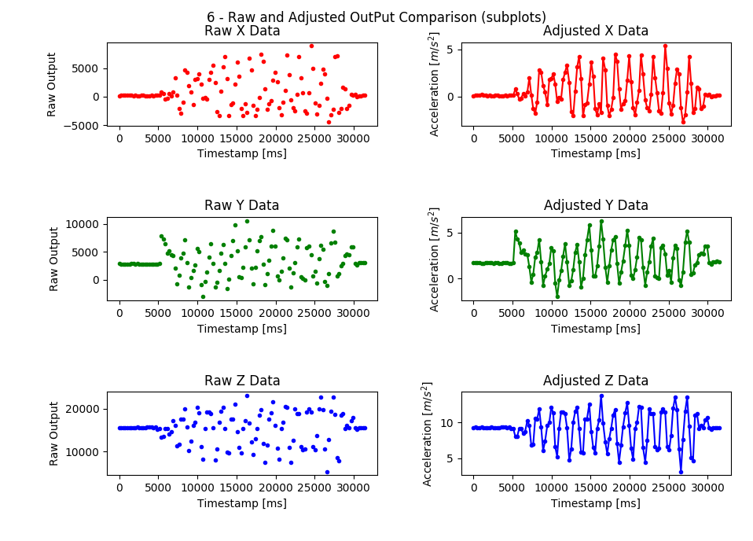

# Welcome

Welcome to the BuzzBoat Arduino Setup Guide. This is a first tutorial to show you an example of data aquisition that can be done for the Solar Boat Project.

## Setup

This experiment is meant to get you set up with the data aquisition system. It uses the arduino accelerometer module to track you as you move the arduino around. Later on, this data will be read from the arduino SD card into a computer for post-processing.

## Required Materials

- [Arduino UNO board](https://store.arduino.cc/usa/arduino-uno-rev3)
- [SD Card Module](https://www.amazon.com/Storage-Memory-Shield-Module-Arduino/dp/B01IPCAP72)
- [Micro SD Card 16 GB](https://www.amazon.com/Micro-Center-Class-Memory-Adapter/dp/B07K835MNR/ref=sr_1_4?dchild=1&keywords=micro+sd+card&nav_sdd=aps&pd_rd_r=9f922f6e-d61f-4d52-bfc6-569fecb70dc9&pd_rd_w=1tPsB&pd_rd_wg=TVKBz&pf_rd_p=f8813af5-8d61-4988-b701-57bd7e498604&pf_rd_r=MV71GVJXZXN2A5EJTEWH&qid=1601353108&refinements=p_n_feature_two_browse-bin%3A6518303011&s=pc&sr=1-4)
- [LIS3DH Accelerometer](https://www.adafruit.com/product/2809)

## Navigating the Repository

Go to <https://github.com/shashanknx/BuzzBoat/> to find the repository. Here, click on the folder "Setup" to access the files for this section.

## Setting up the Arduino

Download the Arduino IDE by clicking on this [link](https://www.arduino.cc/en/software) to get the necessary software installed on your computer. If you have the software or are using the online IDE proceed to the next step.

### Arduino Code

The full coode to use can be found in the repository folder "Setup" under the folder "Arduino". This code is used to take the data from the accelerometer module and save it to the SD card. Load the "accelDemoNew.ino" file into your Arduino.

## Procedure

- Make sure the arduino is running, then move it in a counter clockwise circular motion a few times. (Need to talk to Atman about how to do this precisely)

- You can move the arduino in multiple different ways or even hold it still

## Data

Sample data for this experiment can be found in the "Data" folder.

## Setting up the Python

Use this [tutorial](https://realpython.com/installing-python/) to set up Python on your machine.

## Data Processing with Python

Python code can be found in the "Python" folder. After downloading the entire "Setup" folder, run the `LIS3DH3.py` file to begin data processing with our sample data. You can edit the code to use data you have collected if you want to compare that output to that from our sample data. Be sure to read the comments in the Python code to understand how we processed the data and feel free to customize it for your own purposes.

### Circular Movement

Below is an image of the processed arduino data. As you can see - after adjusting the data the output resembles a sine wave which is characteristic of seim-circular movement.

